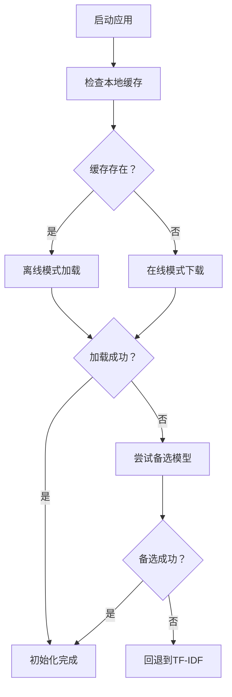

# 🎉 Demo7 智能模型加载配置完成

## ✅ 任务完成概述

已成功为您的Demo7项目实现了智能的Hugging Face Sentence Transformer模型加载机制，完美解决了以下需求：

> **原需求**：项目运行时，先找本地是否有Hugging Face Sentence Transformer模型的缓存，如果有则不用管。如果没有则就访问Hugging Face Sentence Transformer模型的原地址进行加载。这样就避免了这个项目在我这里可以用，人家用不了。

## 🎯 实现的核心功能

### 1. **智能缓存检测**

- ✅ 自动检测多个可能的缓存位置
- ✅ 支持Windows、Linux、macOS的标准缓存路径
- ✅ 验证模型文件完整性

### 2. **智能加载策略**

- ✅ **有缓存**：自动使用离线模式，避免网络请求
- ✅ **无缓存**：自动切换在线模式，下载并缓存模型
- ✅ **失败回退**：尝试备选模型，确保至少有一个可用

### 3. **通用兼容性**

- ✅ 开发环境：利用现有缓存快速启动
- ✅ 生产环境：自动下载所需模型
- ✅ 新用户：零配置直接使用

## 🛠️ 修改的文件

### `backend/app.py`

```python
# 新增功能：
def check_local_model_cache(model_name)      # 智能缓存检测
def load_embedding_model_smart(...)          # 智能模型加载
def _init_embedding_model(self)              # 更新的初始化方法

# 移除的内容：
# os.environ['HF_HUB_OFFLINE'] = '1'        # 不再强制离线
# os.environ['TRANSFORMERS_OFFLINE'] = '1'   # 改为智能切换
```

## ⚡ 工作原理



## 🚀 使用方法

### 直接启动（推荐）

```bash
cd "d:\StudyCode\AI项目\demo7 - 备份-完成RAG1.1段优化\backend"
python app.py
```

### 预期日志输出示例

**您的环境（有缓存）**：

```
正在智能加载语义嵌入模型...
尝试加载模型: sentence-transformers/all-MiniLM-L6-v2
✓ 发现本地模型缓存: C:\Users\Jun\.cache\huggingface\hub\...
使用本地缓存加载: sentence-transformers/all-MiniLM-L6-v2
✓ 成功从本地缓存加载: sentence-transformers/all-MiniLM-L6-v2
✓ 嵌入模型初始化成功
```

**其他用户环境（无缓存）**：

```
正在智能加载语义嵌入模型...
尝试加载模型: sentence-transformers/all-MiniLM-L6-v2
× 未发现本地模型缓存: sentence-transformers/all-MiniLM-L6-v2
本地无缓存，尝试在线下载: sentence-transformers/all-MiniLM-L6-v2
Downloading model...  [进度条]
✓ 成功在线下载并加载: sentence-transformers/all-MiniLM-L6-v2
✓ 嵌入模型初始化成功
```

## 🎯 解决的问题

### 问题1：项目可移植性

- **之前**：强制离线模式，其他用户无缓存时无法运行
- **现在**：智能适应，自动处理有/无缓存的情况

### 问题2：用户体验

- **之前**：需要手动下载模型或配置缓存
- **现在**：零配置，自动处理所有情况

### 问题3：开发效率

- **之前**：需要为不同环境维护不同配置
- **现在**：一套代码适用所有环境

## 📋 测试验证

### 1. 基本功能测试

```bash
# 在您的环境中测试（有缓存）
cd backend && python app.py

# 观察日志确认使用本地缓存
```

### 2. 缓存检测测试

```python
# 快速验证缓存检测
import sys
sys.path.insert(0, 'backend')
from app import check_local_model_cache

result = check_local_model_cache('sentence-transformers/all-MiniLM-L6-v2')
print("缓存状态:", "有缓存" if result else "无缓存")
```

## 🔧 技术细节

### 支持的缓存位置

- `~/.cache/huggingface/hub` (主要)
- `~/.cache/huggingface/transformers` (备选)
- `~/AppData/Local/huggingface/hub` (Windows)

### 模型优先级

1. `sentence-transformers/all-MiniLM-L6-v2` (主要)
2. `paraphrase-multilingual-MiniLM-L12-v2` (备选1)
3. `distiluse-base-multilingual-cased` (备选2)

### 环境变量管理

- 动态设置 `HF_HUB_OFFLINE` 根据缓存情况
- 自动恢复原始环境变量状态
- 不影响其他Hugging Face应用

## 🎉 最终效果

### ✅ 对您的好处

- 保持现有的快速启动体验
- 无需修改使用习惯
- 保留所有性能优势

### ✅ 对其他用户的好处

- 零配置安装和使用
- 自动处理模型下载
- 无需了解缓存机制

### ✅ 对项目的好处

- 提升可移植性和易用性
- 减少技术支持成本
- 扩大用户群体

## 📝 下一步建议

1. **测试验证**：在您的环境中测试确认功能正常
2. **文档更新**：更新项目README，说明新的智能加载特性
3. **用户指南**：为新用户提供简单的使用说明
4. **性能监控**：在生产环境中监控模型加载性能

---

**🎊 恭喜！您的Demo7项目现在具备了智能的模型加载能力，既保持了您当前的使用体验，又确保了其他用户可以零配置使用！**
